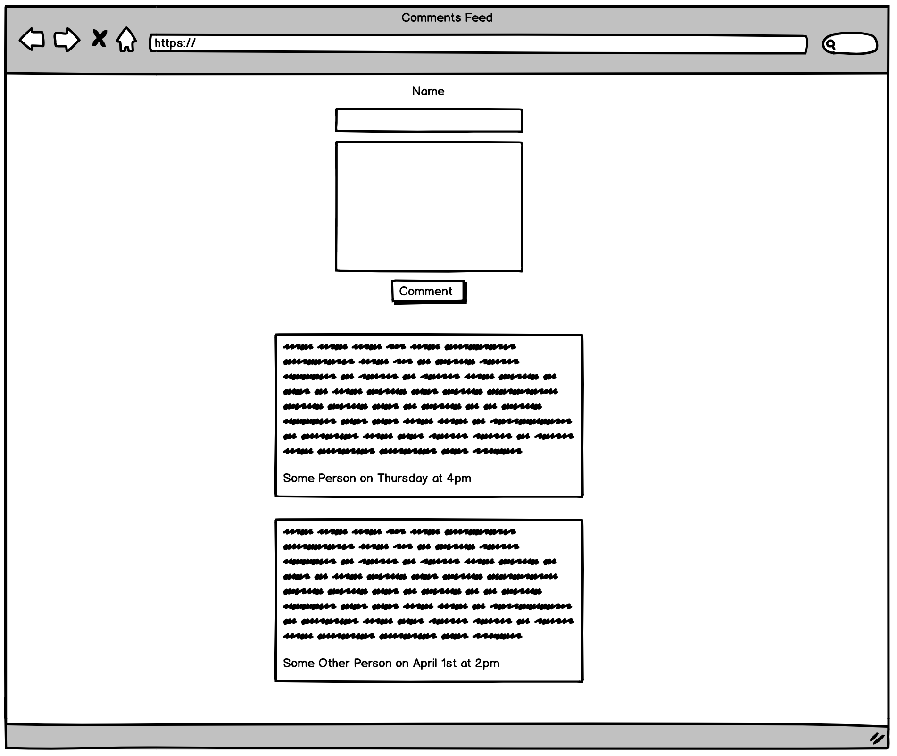

# Front-end
Design and build a comments feed that displays all comments and notifies a user in real-time when new comments are added.

Here is the data schema for a Comment:
* id: INTEGER
* name: TEXT
* created: DATETIME
* message: TEXT

Here are the API endpoints:
* Create a comment: /createComment (POST)
* Retrieve all comments: /getComments (GET)
* Retrieve a comment: /getComment (GET)
* Delete all comments: /deleteComments (DELETE)
  * This is useful for purging data





## Usage


### Setup Backend
```
$ npm install  
```
### Setup Frontend
```
$ cd ./public/commentsFeed 
$ npm install  
```
### Run Both frontend and backend in Development
```
$ npm run dev
```
### Run only Frontend
```
$ npm run startFrontend  
```